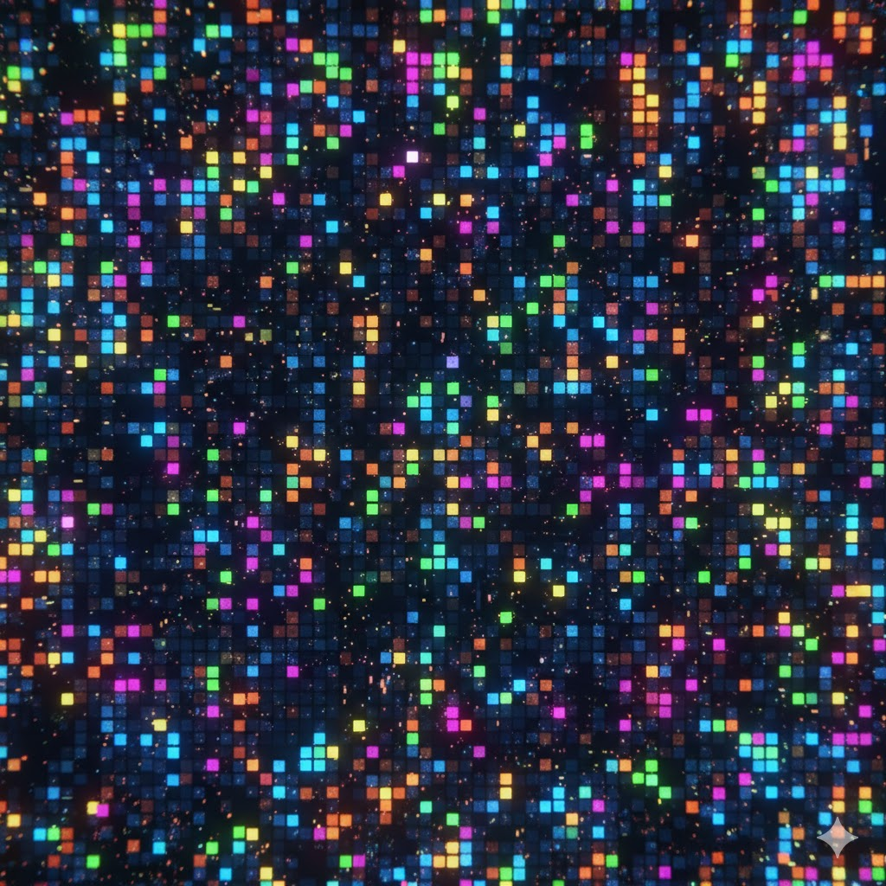

<p align="center">
  
</p>

<h1 align="center">🧩 Puzzles Club</h1>

<p align="center">
  <strong>An Educational Web3 Capture The Flag (CTF) Experience</strong>
</p>

<p align="center">
  <em>It's not just NFTs — it's a challenge, an adventure, a way to learn how the crypto world works<br/>while having fun and earning NFTs and Unstoppable Domains.</em>
</p>

<p align="center">
  <a href="https://puzzlesclub.xyz">🌐 Play Now</a> •
  <a href="https://opensea.io/collection/puzzles-polygon">🧩 Buy Puzzles</a> •
  <a href="https://opensea.io/collection/puzzle-words-polygon">💬 Buy Hint Words</a>
</p>

<p align="center">
  
  
  
  
</p>

---

## 🎯 The Challenge

We've all been there when we started — the crypto world can feel overwhelming. **Puzzles Club** offers you the opportunity to acquire **solid knowledge** in the crypto world while competing for real digital assets.

Each puzzle is a cryptographic challenge: recover a 12-word BIP-39 seed phrase, unlock a reward wallet, and claim everything inside — **before anyone else does**.

> _"Your Private Keys, Your Cryptos"_ — Always remember our motto.

### What You'll Learn

- 🔑 How **BIP-39 mnemonic phrases** and HD wallets work
- 🧮 **Derivation paths** and how they generate addresses
- 🔍 How to use **vanity addresses** and blockchain explorers
- ⚡ Controlled **brute-force** techniques over reduced dictionaries
- 🌐 How to interact with **NFTs, wallets, and Web3** in a practical way

---

## 🎮 How to Play

```
┌──────────────┐     ┌──────────────┐     ┌───────────────┐     ┌──────────────┐     ┌──────────────┐
│  1. Buy a    │────▶│  2. Read its │────▶│ 3. Enter the  │────▶│ 4. Solve the │────▶│ 5. Claim the │
│  Puzzle NFT  │     │    Clues     │     │  Puzzles Club │     │    Puzzle    │     │   Rewards!   │
└──────────────┘     └──────────────┘     └───────────────┘     └──────────────┘     └──────────────┘
```

### Step 1 — Acquire a Puzzle NFT 🛒

Head to the **[Puzzles - (Polygon)](https://opensea.io/collection/puzzles-polygon)** collection on OpenSea and purchase your puzzle. Each NFT is your **access key** to the challenge — choose your difficulty level wisely!

> Every puzzle has a **12-word BIP-39 recovery phrase**. The structure is always the same:
> - **Word #1** — Provided via the vanity address (first 3 chars after `0x` match this word)
> - **Words #2 to #11** — The **10 unknown intermediate words** you need to discover
> - **Word #12** — Always `zoo`

### Step 2 — Study the Clues 🔎

Your Puzzle NFT contains **critical secret information** in both its description and traits:

| Clue | What it tells you |
|------|-------------------|
| **Vanity address** | The target public address — first 3 chars after `0x` reveal **Word #1** |
| **Word #12** | Always `zoo` — this is constant across all puzzles |
| **Mini-dictionary** | A reduced word list of **N words** (where N = your puzzle level) extracted from the BIP-39 dictionary (2048 words). The 10 missing words were taken from this list |
| **Derivation path** | The Room or Address index to use for wallet generation |
| **Difficulty level** | The level number (10–16+) determines the size of the mini-dictionary |

> 📖 _"Don't forget to carefully read all the NFT's Traits, which, along with the description, contain secret clues to open the wallet."_

### Understanding the Difficulty

The **level number equals the size of the mini-dictionary**. All puzzles have exactly **10 unknown words**, but the difficulty comes from how many words are in the mini-dictionary they were taken from:

- **Level #10** → Mini-dictionary of **10 words** → The 10 missing words are all 10 words from the dictionary, you just need to find the **correct order**
- **Level #15** → Mini-dictionary of **15 words** → The 10 missing words were taken from 15 possible words — you need to find **which 10** and their **correct order**
- **Level #16** → Mini-dictionary of **16 words** → Even more possibilities to test

> 🧮 The number of valid combinations follows the permutation formula **P(N, 10) = N! / (N−10)!** where N is the level number (mini-dictionary size). Higher levels mean exponentially more combinations to check.

### Step 3 — Enter Puzzles Club 🖥️

Visit **[Puzzles Club](https://puzzlesclub.xyz)** and connect the same wallet where your Puzzle NFT is hosted. The platform will:

- ✅ Detect your Puzzle NFT and unlock **confidential content**
- ✅ Show the **vanity public address** and the **mini-dictionary** for your puzzle
- ✅ Display any **Puzzle Words** you own as revealed hints
- ✅ Provide access to educational whitepapers (Bitcoin & Ethereum)

### Step 4 — Solve the Puzzle 🧠

The challenge: find the **correct 10 words in the correct order** from your mini-dictionary to complete the 12-word BIP-39 recovery phrase. Use the vanity address and derivation path to validate your attempts.

**Stuck?** You're fighting against the Numbers — but you don't have to fight alone! 👇

### Step 5 — Claim Your Reward 🏆

Once you recover the full seed phrase, you gain access to the **reward wallet**. Be the **first** to claim all the digital assets inside!

> ⚠️ **Winner-Takes-All**: There is only one reward wallet per puzzle level. Whoever gets there first takes it all. FOMO is real — DYOR!
> 
> _Always remember our motto: **"Your Private Keys, Your Cryptos"**_

---

## 💬 Puzzle Words — Your Secret Weapon

<p align="center">
  <a href="https://opensea.io/collection/puzzle-words-polygon">
    
  </a>
</p>

**[Puzzle Words - (Polygon)](https://opensea.io/collection/puzzle-words-polygon)** is a collection of secret words that make solving puzzles **much easier**. Each word you buy brings you one step closer to the solution.

### How Puzzle Words Work

When you purchase a Puzzle Word NFT, it acts as a **key** in Puzzles Club:

> _"You can use this NFT as a key in Puzzles Club to access Word #9 of the recovery phrase for the Puzzle you're solving. Knowing an extra word and its true position will significantly reduce the possible combinations of valid phrases, making the puzzle easier to solve."_

**Example:** Imagine you have a Level #16 puzzle (mini-dictionary of 16 words, 10 unknown positions). Each Puzzle Word you buy **reveals one word and its exact position**, removing it from the unknowns:

| Puzzle Words Purchased | Remaining Unknowns | Remaining Dict. Words | Combinations P(N, K) |
|----------------------|-------------------|----------------------|---------------------|
| 0 (no help) | 10 positions | 16 words | P(16,10) = ~29 billion |
| Buy 2 words | 8 positions | 14 words | P(14,8) = ~121 million |
| Buy 4 words | 6 positions | 12 words | P(12,6) = ~665,280 |
| Buy 6 words | 4 positions | 10 words | P(10,4) = ~5,040 |
| Buy 8 words | 2 positions | 8 words | P(8,2) = 56 |

> 🎯 Each Puzzle Word you buy **reveals one word and its exact position**, turning an impossible challenge into a solvable one!

> ⚡ _"Remember, you're fighting against the Numbers! So don't hesitate to buy puzzle words and defeat them."_

> ⚠️ _"Keep in mind that if the puzzle's difficulty level is very high, you might need more words to further reduce the difficulty."_

---

## 📊 Difficulty Levels

Each puzzle level determines the **size of the mini-dictionary** from which the 10 unknown intermediate words were taken. All puzzles have the same structure (10 unknown words), but the larger the dictionary, the more combinations exist:

| Level | Difficulty | Dict. Size | Unknown Words | Combinations P(N, 10) | Reward |
|-------|-----------|-----------|---------------|----------------------|--------|
| **#10** | 🟢 Easy | 10 words | 10 | P(10,10) = 3,628,800 | 10 Curated NFTs + 10 Unstoppable Domains |
| **#11** | 🟡 Medium | 11 words | 10 | P(11,10) = 39,916,800 | 11 Curated NFTs + 11 Unstoppable Domains |
| **#12** | 🟠 Hard | 12 words | 10 | P(12,10) = 239,500,800 | 12 Curated NFTs + 12 Unstoppable Domains |
| **#13** | 🔴 Expert | 13 words | 10 | P(13,10) = ~1.04 billion | 13 Curated NFTs + 13 Unstoppable Domains |
| **#14** | 🟣 Master | 14 words | 10 | P(14,10) = ~3.63 billion | 14 Curated NFTs + 14 Unstoppable Domains |
| **#15** | ⚫ Legendary | 15 words | 10 | P(15,10) = ~10.9 billion | 15 Curated NFTs + 15 Unstoppable Domains |
| **#16** | 💀 Impossible | 16 words | 10 | P(16,10) = ~29.1 billion | 16 Curated NFTs + 16 Unstoppable Domains |

> 🔮 More levels coming soon — theoretically up to Level #2046!

---

## 🏆 Rewards

Each puzzle level has its own dedicated **reward wallet** containing premium digital assets. The number of rewards **scales with difficulty** — harder puzzles yield more prizes. You can verify the contents on OpenSea before you play:

| Level | Difficulty | Curated NFTs | Unstoppable Domains | Reward Wallet |
|-------|-----------|:------------:|:-------------------:|:-------------:|
| **#10** | 🟢 Easy | 10 | 10 | [View on OpenSea](https://opensea.io/0x10BcB71dd52f9C1BE33Ff24463aF742a6e088A77) |
| **#11** | 🟡 Medium | 11 | 11 | [View on OpenSea](https://opensea.io/0x11BC28C14b3e31661Bc8Ff7169c4741624862981) |
| **#12** | 🟠 Hard | 12 | 12 | [View on OpenSea](https://opensea.io/0x12ba3728941f7ef65456E7123393A4A21532703f) |
| **#13** | 🔴 Expert | 13 | 13 | [View on OpenSea](https://opensea.io/0x13BB32f506C2253ae9cbC8C1de240881cAF81C85) |
| **#14** | 🟣 Master | 14 | 14 | [View on OpenSea](https://opensea.io/0x14Bfe2140dec59758Bfe000f142674910C700081) |
| **#15** | ⚫ Legendary | 15 | 15 | [View on OpenSea](https://opensea.io/0x15b4B3121874A6D3Df87793774fa3B1F9A56D534) |
| **#16** | 💀 Impossible | 16 | 16 | [View on OpenSea](https://opensea.io/0x16B9F9a8D2211b0181510453cD842238373d1539) |

> ⚠️ **Winner-Takes-All**: There is only one reward wallet per puzzle level. Whoever gets there first takes it all!

---

## ✨ Platform Features

- 🎮 **Interactive Matrix-Themed UI** — Immersive hallway → desk → terminal intro with 3D elements
- 🔐 **Wallet Integration** — MetaMask & WalletConnect support
- 🧩 **Smart NFT Detection** — Automatic detection of your Puzzles and Puzzle Words
- 🏆 **Real-time Reward Tracking** — See what's inside each reward wallet
- 🛒 **Puzzle Words Integration** — Purchased hint words are automatically revealed
- 📄 **Confidential Documents** — In-app whitepaper viewer (Bitcoin & Ethereum)
- 🌍 **Multilingual** — English, Spanish, Valencian, Chinese, Hindi, Russian & Arabic
- 🌗 **Dark/Light Themes** — Matrix-inspired aesthetics
- 🎵 **Ambient Audio** — Optional background music for immersion
- 📱 **Fully Responsive** — Desktop and mobile optimized
- 🔄 **Real-time Features** — Live online user counter

---

## ❓ FAQ

<details>
<summary><strong>If anyone can 'right-click and save' the image, what am I actually paying for?</strong></summary>
<br/>
You're paying for verifiable on-chain ownership. The NFT isn't just an image — it's your cryptographic key to access exclusive puzzle content and compete for real rewards.
</details>

<details>
<summary><strong>How do I know my NFT won't disappear if the marketplace goes bust?</strong></summary>
<br/>
Your NFTs live on the Polygon blockchain, not on OpenSea. The marketplace is just an interface — your assets exist independently on-chain forever.
</details>

<details>
<summary><strong>What if the puzzle is too hard for me?</strong></summary>
<br/>
That's exactly why <a href="https://opensea.io/collection/puzzle-words-polygon">Puzzle Words</a> exist! Each word you buy reveals its true position in the recovery phrase, dramatically reducing the number of combinations. You can buy as many as you need until the puzzle is solvable.
</details>

<details>
<summary><strong>Can someone else solve my puzzle before me?</strong></summary>
<br/>
Yes! This is a Winner-Takes-All competition. Each reward wallet can only be claimed once. Speed and skill matter — but remember, buying Puzzle Words gives you a significant advantage.
</details>

<details>
<summary><strong>What makes 'generative art' NFTs different from standard digital art?</strong></summary>
<br/>
Generative art is created algorithmically, making each piece mathematically unique. In Puzzles Club, each NFT is also functionally unique — it grants access to a specific puzzle with its own reward.
</details>

---

<p align="center">
  <strong>For you, players. Let the game begin. 🎮</strong>
</p>

<p align="center">
  <em>Puzzles | Polygon Network | 2026 NFT</em>
</p>

---

<p align="center">
  Built with ❤️ by the Puzzles Club team
</p>
